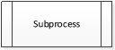
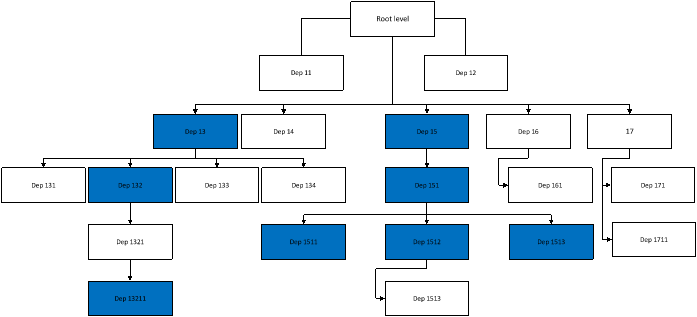
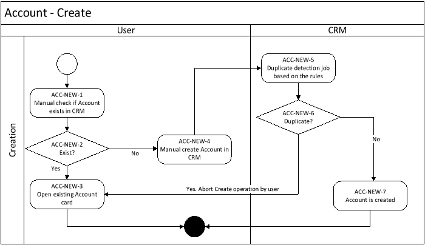
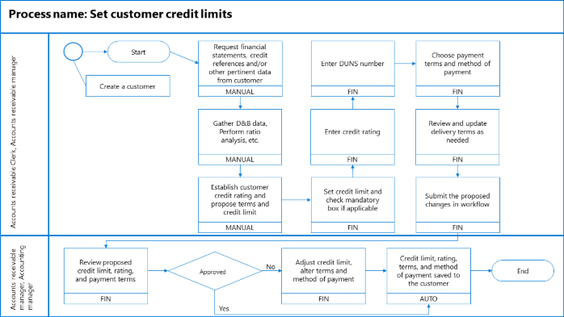
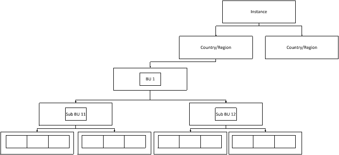

|Customer LOGO|**FUNCTIONAL DESIGN DOCUMENT**|Partner LOGO|
| :- | :-: | -: |

FUNCTIONAL / TECHNICAL DESIGN DOCUMENT

Project: 

Prepared by: 

2023

Name of the parties’ POC

**Partner**

|**Title**|**Name**|**Email**|**Contact Number**|
| :- | :- | :- | :- |
|||||
|||||
|||||
|||||

**Customer**

|**Title**|**Name**|**Email**|**Contact Number**|
| :- | :- | :- | :- |
|||||
|||||
|||||
|||||
Sheet accounting changes

|**Version**|**Changes**|**The Initiator**|**Date**|
| :- | :- | :- | :- |
|0\.0|Initial Draft|First Last name|DD/MM/YY|

**Table of Contents**

[1**	**INTRODUCTION	7****](#_toc138859263)**

[1.1	The composition of the document	7](#_toc138859264)

[1.2	Abbreviations	7](#_toc138859265)

[1.3	Transcript schemes of business processes	7](#_toc138859266)

[**2**	**PROJECT OVERVIEW	9****](#_toc138859267)

[2.1	Scope	9](#_toc138859268)

[**3**	**ORGANIZATION STRUCTURE AND FUNCTIONAL RESPONSIBILITIES IN THE SOLUTION	10****](#_toc138859269)

[3.1	Department description 1	10](#_toc138859270)

[*3.1.1*	*Unit 1	10**](#_toc138859271)

[*3.1.2*	*Unit 2	10**](#_toc138859272)

[3.2	Department description 2	10](#_toc138859273)

[*3.2.1*	*Unit 1	10**](#_toc138859274)

[*3.2.2*	*Unit 2	10**](#_toc138859275)

[**4**	**DESCRIPTION OF BUSINESS PROCESSES	11****](#_toc138859276)

[4.1	Common information about organization process	11](#_toc138859277)

[4.2	Accounts	11](#_toc138859278)

[*4.2.1*	*Create Account	11**](#_toc138859279)

[4.3	Leads	13](#_toc138859280)

[*4.3.1*	*Business process N	13**](#_toc138859281)

[**5**	**ARCHITECTURE SOLUTION DESIGN	13****](#_toc138859282)

[5.1	Data requirements (conceptual object model)	13](#_toc138859283)

[*5.1.1*	*Scalability and performance considerations	13**](#_toc138859284)

[5.2	Table structure	14](#_toc138859285)

[*5.2.1*	*Table options that can only be enabled	14**](#_toc138859286)

[*5.2.2*	*Enable or disable table options	14**](#_toc138859287)

[*5.2.3*	*Field properties	15**](#_toc138859288)

[*5.2.4*	*Possible data types for a field	16**](#_toc138859289)

[*5.2.5*	*Data naming (specify names of fields)	17**](#_toc138859290)

[*5.2.6*	*Common fields for all tables	18**](#_toc138859291)

[5.3	Column structure of business objects	19](#_toc138859292)

[*5.3.1*	*Account (OOB)	19**](#_toc138859293)

[*5.3.2*	*Contact (OOB)	20**](#_toc138859294)

[*5.3.3*	*Lead (OOB)	21**](#_toc138859295)

[5.4	Column structure of normative reference information	22](#_toc138859296)

[*5.4.1*	*Table N (Custom)	22**](#_toc138859297)

[**6**	**SECURITY REQUIREMENTS (ROLE MODEL FOR ACCESS)	23****](#_toc138859298)

[6.1	Hierarchy Business Unit in the system	23](#_toc138859299)

[6.2	Security roles	23](#_toc138859300)

[*6.2.1*	*Role 1	23**](#_toc138859301)

[*6.2.2*	*Role 2	24**](#_toc138859302)

[**7**	**ADDITIONAL FUNCTIONALITY	25****](#_toc138859303)

[7.1	Dynamics 365 App for Outlook	25](#_toc138859304)

[7.2	Manage transactions with multiple currencies	25](#_toc138859305)

[7.3	Duplication rules	25](#_toc138859306)

[*7.3.1*	*Account	25**](#_toc138859307)

[*7.3.2*	*Contact	25**](#_toc138859308)

[*7.3.3*	*Lead	26**](#_toc138859309)

[7.4	Support for mobile devices	26](#_toc138859310)

[7.5	Multilingual support	26](#_toc138859311)

[7.6	Editable grids	26](#_toc138859312)

[7.7	System notifications	27](#_toc138859313)

[*7.7.1*	*Email notifications	27**](#_toc138859314)

[*7.7.2*	*Push Notifications	27**](#_toc138859315)

[*7.7.3*	*In-App Notifications	27**](#_toc138859316)

[7.8	Scan business card	27](#_toc138859317)

[7.9	Compliance	27](#_toc138859318)

[7.10	Dynamics 365 Sales Insights (Microsoft solution)	27](#_toc138859319)

[7.11	Enhanced Search to improve search results and performance	27](#_toc138859320)

[**8**	**REPORTING AND ANALYTICS	28****](#_toc138859321)

[8.1	Reports	28](#_toc138859322)

[*8.1.1*	*Report 1	28**](#_toc138859323)

[8.2	Dashboards	28](#_toc138859324)

[8.3	Data warehousing strategy	28](#_toc138859325)

[**9**	**INTEGRATION	30****](#_toc138859326)

[9.1	Logging mechanism	30](#_toc138859327)

[9.2	Integration 1	30](#_toc138859328)

[*9.2.1*	*Scope	30**](#_toc138859329)

[*9.2.2*	*Interface design	30**](#_toc138859330)

[**10**	**MIGRATION	31****](#_toc138859331)

1. # **Introduction**
   1. ## **The composition of the document**
The functional design document (FDD) contains:

- Scope
- Organization structure: The functional management of departments for creating a security model of the solution
- Business process: The schema of business process in the solution
- Architecture solution design: Object model, Data model
- Additional customization
- Security Roles
- Integration
- Data Migration
  1. ## ` `**Abbreviations**

|**Abbreviations**|**Transcript**|
| :- | :- |
|Plug-in|Plug-in is a software component that adds a specific feature to an existing software application|
|POC|Point of contact|
|FDD|Functional Design Document|
|TDD|Technical Design Document|
|||
|||
|||
|||
|||
|||
|||
1. ## **Transcript schemes of business processes**

|**Symbol**|**Comment**|
| :-: | :- |
||Division of the company using the system and has in its composition subordinates’ other units.|
||Department of the company using the system.|
||Department of the company, non-automation|
||Start of processes|
||End of processes|
||Link for process «»|
||Operation «»|
||Integration operation «»|
||The logical question «»|
||The following function starts only after the end of a previous|
||After the end of the function, the following functions are run in parallel|

1. # **Project overview**
   1. ## **Scope**
The scope of the service includes the following:

*Usually, this section contains the FitGap analysis worksheet – see template.*

*Sometimes, the functional design document doesn’t contain all out-of-band features that are available for Dynamics 365 but only changes or critical functions which are going to be used.*

1. # **Organization structure and functional responsibilities in the solution**

1. ## **Department description 1**
   1. ### **Unit 1**
   1. ### **Unit 2**
1. ## **Department description 2**
   1. ### **Unit 1**
   1. ### **Unit 2**
1.
|||Page | **277**|
| :- | :-: | -: |

1. # **Description of business processes**
   1. ## **Common information about organization process**
This document includes the following business processes to be automated:

1. Accounts 
1. Leads
1. Business process N

Model business processes contained in this document consists of the following components:

- Business process diagram - process diagrams with detailed level of functions and performers;
- Tables of functions / operations - a text description of the business functions / operations, including a description of incoming / outgoing information and performers
  1. ## **Accounts**
     1. ### **Create Account**
        1. #### ***Process Flow***

|**Step Id**|**Description**|**Remarks**|
| :- | :- | :- |
|ACC-NEW-01|Manual Check if ‘Account’ Exists in the system?|User needs to manually check if the ‘Account’ profile which he / she is going to create has existed in the system already.|
|ACC-NEW-02|Exist?|Based on the input key words, which have been pre-defined as searchable, the system will filter out the similar records to users.|
|ACC-NEW-03|Open existing Account Card|If the account exists already, the system will open the existing account and abort the creation process by user. |
|ACC-NEW-04|Manual Create ‘Account’ Profile in the system.|User needs to manually create the ‘Account Profile in the system if it doesn’t exist already.|
|` `ACC-NEW-05|Duplicate Detect based on the rule|The system will do the duplication detect based on the rule|
|` `ACC-NEW-06|Duplicate?|If duplicate records are found in the system, abort the creation process and go to step ACC-NEW-03.|
|` `ACC-NEW-07|
Account Creation Process

 
|If duplicated account Profile is not found in the system, then Account profile is created in the system.|

1. #### ***Functional design***

|**ID**|**Description**|**Rules / Examples/ Comments**|
| :- | :- | :- |
||||
||||
1. ## **Leads**
   1. ### **Business process N**
      1. #### ***Process flow***

|**Step Id**|**Description**|**Remarks**|
| :- | :- | :- |
||||
||||
||||
||||

1. #### ***Functional design***

|**ID**|**Description**|**Rules / Examples/ Comments**|
| :- | :- | :- |
||||
||||

1. # **Architecture solution design**
   1. ## **Data requirements (conceptual object model)**
      1. ### **Scalability and performance considerations**
Please include metadata relationships in these sections. Also, it would be helpful to have indexes which will be included in the tables. Data archrival strategy / long retention strategy
1. ## **Table structure**
   1. ### **Table options that can only be enabled**

|**Option**|**Comments**|
| :- | :- |
|Business process flows|Create business process flows for this table. More information: [Create a business process flow to standardize processes](https://docs.microsoft.com/en-us/dynamics365/customer-engagement/customize/create-business-process-flow)|
|Notes|Append notes to records for this table. Notes include the ability to add attachments.|
|Activities|Associate activities to records for this table.|
|Connections|Use the connections feature to show how records for this table have connections to records of other tables that also have connections enabled.|
|Sending e-mail (if an e-mail field does not exist, one will be created)|Send emails using an email address stored in one of the fields for this table. If a Single Line of Text field with format set to email doesn’t already exist for this table, a new one will be created when you enable sending email.|
|Queues|Use the table with queues. Queues improve routing and sharing of work by making records for this table available in a central place that everyone can access.|

1. ### **Enable or disable table options**

|**Option**|**Comments**|
| :- | :- |
|Primary Image|
System tables that support images will already have an **Image** field. You can choose whether to display data in this field as the image for the record by setting this field to **[None]** or **Default Image**.

 For custom tables you must first create an image field. Each table can have only one image field. After you create one, you can change this setting to set the primary image. More information: [Image fields](https://docs.microsoft.com/en-us/dynamics365/customer-engagement/customize/types-of-fields#BKMK_ImageFields)
|
|Mail Merge|User can use this table with mail merge.|
|Document Management|After other tasks have been performed to enable document management for your organization, enabling this feature allows for this table to participate in integration with SharePoint.|
|Duplicate Detection|If duplicate detection is enabled for your organization, enabling this allows you to create duplicate detection rules for this table.|
|Allow Quick Create|
After you have created and published a **Quick Create Form** for this table, User will have the option to create a new record using the **Create** button in the navigation pane.

When this is enabled for a custom activity table, the custom activity will be visible in the group of activity tables when people use the **Create** button in the navigation pane. However, because activities don’t support quick create forms, the main form will be used when the custom table icon is clicked.
|
|Auditing|When auditing is enabled for your organization, this allows for changes to table records to be captured over time. When you enable auditing for an table, auditing is also enabled on all its fields. You can select or clear fields that you want to enable auditing on.|
|Access Teams|Create team templates for this table.|
|Enable for phone express|Make this table available to the Dynamics 365 for phones app.|
|Enable for mobile|
Make this table available to the Dynamics 365 for phones and tablets apps. You also have the option to make this table **Read-only in mobile**.

If the forms for an table require an extension not supported in Dynamics 365 for phones and tablets, such as iFrame or web resource controls, use this setting to ensure that mobile app users can’t edit the data for these tables.

**Important:** If you have previously installed any portal solution, to create a case in the Customer Service Hub or to use the Merge cases command, you must turn off the **Read-only in mobile option** for the Case table.
|

1. ### **Field properties**

|**Option**|**Comments**|
| :- | :- |
|Display Name|The name that appears as a label in the heading for lists where this attribute is included. It is also the default label when this field is shown in a form, but the label text in each form can be edited separately.|
|Name|This field is prepopulated based on the **Display Name** you entered. It includes the solution publisher customization prefix. You can change the **Display Name** later, but the **Name** can’t be changed after the field is saved.|
|Field Requirement|
There are three options:

- **Optional**

The record can be saved even if there is no data in this field.

- **Business Recommended**

The record can be saved even if there is no data in this field. However, a blue asterisk appears next to the field to indicate it is important.

- **Business Required**

The record can’t be saved if there is no data in this field.

Be careful when you make fields business required. People will resist using the application if they can’t save records because they lack the correct information to enter into a required field. People may enter incorrect data simply to save the record and get on with their work.

You can use business rules or form scripts to change the requirement level as the data in the record changes as people work on it.
|
|Searchable|When a field is searchable it appears in Advanced Find and is available when customizing views. Use this when there are fields for the table that you don’t use. Setting this to **No** will reduce the number of options shown to user using advanced find.|
|Field Security|For custom fields, enable this to allow this field to participate in field-level security.|
|Auditing|Disable this so that data in this field won’t be included with auditing data.|
|Description|Enter text that will appear as a tooltip when the field is displayed in a form. |

1. ### **Possible data types for a field**

|**Data Type**|**Notes**|
| :- | :- |
|Single Line of Text|
The following formats are available:

o **E-mail**. This opens a new e-mail message in the default e-mail software when clicked and also validates an email address.

&emsp;o **Text**. This creates a text box.

&emsp;o **Text area**. This creates a scrolling text box.

&emsp;o **URL**. This opens the URL in the user's default browser when clicked and validates (or adds) a valid protocol (HTTP, HTTPS, FTP, FTPS, OneNote, and TEL) are allowed.

&emsp;o **Ticker Symbol**. This creates a stock ticker symbol in all capital letters. Click the symbol to open information about the stock in the user's default browser. By default, the MSN website opens.

&emsp;o Phone. This creates a link that enables Skype or Microsoft Lync users to initiate a call by using the linked number.
|
|Option Set|Select an existing option set or define a new one. |
|MultiSelect Option Set|This field provides a set of options, where multiple options can be selected. When added to a form, this field uses a control for users to select multiple options.|
|Two Options|After creating this field, configure it in the form to which it was added. In the form, select whether the field is displayed as option buttons (also known as radio buttons), a check box, or a list.|
|Image|Each table can have one image field. When an table has an image field it can be configured to display the image for the record in the application.|
|Whole Number|
The following formats are available for this field:

o **None.** The defaults are integer values between -2,147,483,648 and 2,147,483,648, although you can set different minimum and maximum values.

&emsp;o **Duration.** This creates a drop-down list box with values in minutes, hours, and days.

&emsp;o **Time Zone.** This creates a drop-down list box with options for every available time zone.

&emsp;o Language. This creates a drop-down list box with options for every language that your organization has made available for users.
|
|Floating Point Number|Select up to 5 precision points. You can set the minimum and maximum values.|
|Decimal Number|Select up to 10 decimal points. You can set the minimum and maximum values.|
|Currency|
When you add a currency field to an table, a corresponding (Base) field is also created. The (Base) field also has a currency data type.

If the table does not already have a field with a currency data type, two additional fields are created:

o **Currency.** A lookup data type whose value must be set before you can set the value of a field with a currency data type.

&emsp;o **Exchange Rate**. This has a decimal number data type.
|
|Multiple Lines of Text|This is a scrolling text box. You can set the maximum number of characters for this field.|
|Date and Time|There are two formats: date only, or date and time.|
|Lookup|You can create a lookup field using an table relationship that has already been created, but not yet used with another lookup field. If you create a lookup field in an table form, the relationship is automatically generated. A lookup field is created as a relationship field.|
1. ### **Data naming (specify names of fields)**

|**Option**|**Description**|
| :- | :- |
|Publisher Display Name|Default publisher|
|Name Publisher (schema name)|new|
|Prefix|new|
|Option Value Prefix|10000|
|Data type – string, money, all types of numbers - schema name|Logical name of fields. For example: Field name – Account; Schema name – new\_account|
|Data type – option set - schema name|Logical name of fields ***+ code***. For example: Field name – Account type; Schema name – new\_accounttype**code**|
|Data type – two options (bit) - schema name|***IS +*** Logical name of fields. For example: Field name – Partner support project; Schema name – new\_***is***partnerproject|
|Data type – date - schema name|Logical name of fields ***+ date***. For example: Field name – Payment date; Schema name – new\_payment***date***|
|Data type – lookup - schema name|Logical name of fields ***+ id***. For example: Field name – Contact; Schema name – new\_contact***id***|
|schema name|All schema name should have small letters|
1. ### **Common fields for all tables**

|**No**|**Display Name**|**Schema Name**|**Field Type**|**Requirement**|**Notes**|**Read Only**|
| :- | :- | :- | :- | :- | :- | :- |
||Owner|ownerid|Lookup (user/team)|+|Owner is only for User/Team ownership type||
||Modified By|modifiedby|Lookup (user)|+|Shows who last updated the record.|+|
||Modified On|modifiedon|Date and Time|+|Shows the date and time when the record was last updated. The date and time are displayed in the time zone selected in Microsoft Dynamics 365 options.|+|
||Created By|createdby|Lookup (user)|+|Shows who created the record.|+|
||Created On|createdon|Date and Time|+|Shows the date and time when the record was created. The date and time are displayed in the time zone selected in Microsoft Dynamics 365 options.|+|
||Status|statecode|
States:

0: Active

1: Inactive
||By default if not we specified for a concrete table (for example Opportunity) ||
||Status Reason|statuscode|
States:

1: Active

2: Inactive
||By default if not we specified for a concrete table (for example Opportunity)||

1. ## **Column structure of business objects**
   1. ### **Account (OOB)**
      1. #### ***General***

|**Option**|**Enable / Disable**|
| :- | :- |
|Display Name|Account|
|Plural Name|Accounts|
|Schema name (Table)|account|
|Primary field (schema name)|name|
|Business process flows||
|Notes|Yes|
|Activities|Yes|
|Connections|Yes|
|Sending e-mail (if an e-mail field does not exist, one will be created)|Yes|
|Queues|Yes|
|Primary Image|Yes|
|Mail Merge|Yes|
|Document Management||
|Duplicate Detection|Yes|
|Allow Quick Create|Yes|
|Auditing|Yes|
|Access Teams||
|Enable for phone express|Yes|
|Enable for mobile|Yes|
|Ownership|User or Team|

1. #### ***Form (Main)***
Visible for all roles

|**No**|**Display Name**|**Schema Name**|**Field Type**|**Requirement**|**Notes**|**Read Only**|**Searchable**|
| :- | :- | :- | :- | :- | :- | :- | :- |
||Account Name|Name|Single Line of Text (128)|+|||+|
||Account type|accounttype|
Option set:

1\.Prospect

2\.Customer
|+|||+|
||Address|Address1\_composite|Multiline (1000)||Combine City, Street, ZIP, State, Country/Region on one line|+|+|

1. #### ***Usability and user interface considerations***

1. ### **Contact (OOB)**
   1. #### ***General***

|**Option**|**Enable / Disable**|
| :- | :- |
|Display Name|Contact|
|Plural Name|Contacts|
|Schema name (Table)|contact|
|Primary field (schema name)|fullname|
|Business process flows||
|Notes|Yes|
|Activities|Yes|
|Connections|Yes|
|Sending e-mail (if an e-mail field does not exist, one will be created)|Yes|
|Queues|Yes|
|Primary Image|No|
|Mail Merge|Yes|
|Document Management||
|Duplicate Detection|Yes|
|Allow Quick Create|Yes|
|Auditing|Yes|
|Access Teams||
|Enable for phone express|Yes|
|Enable for mobile|Yes|

1. #### ***Form (Main)*** 

|**No**|**Display Name**|**Schema Name**|**Field Type**|**Requirement**|**Notes**|**Read Only**|**Searchable**|
| :- | :- | :- | :- | :- | :- | :- | :- |
||Full name|name|Single Line of Text (300) Composite|+|Full name of client (First name + Last Name + Middle name)|+|+|
||First name|firstname|Single Line of Text (50)|+|||+|
||Last name|lastname|Single Line of Text (50)|+|||+|
||Middle name|middlename|Single Line of Text (50)||||+|
||Job Title|jobtitle|Single Line of Text (100)||||+|
1. #### ***Usability and user interface considerations***
1. ### **Lead (OOB)**

1. #### ***General***

|**Option**|**Enable / Disable**|
| :- | :- |
|Display Name|Lead|
|Plural Name|Leads|
|Schema name (Table)|lead|
|Primary field (schema name)|name|
|Business process flows||
|Notes|Yes|
|Activities|Yes|
|Connections|Yes|
|Sending e-mail (if an e-mail field does not exist, one will be created)|Yes|
|Queues|Yes|
|Primary Image|No|
|Mail Merge|Yes|
|Document Management||
|Duplicate Detection|Yes|
|Allow Quick Create|Yes|
|Auditing|Yes|
|Access Teams||
|Enable for phone express|Yes|
|Enable for mobile|Yes|

1. #### ***Form (Main)***

|**No**|**Display Name**|**Schema Name**|**Field Type**|**Requirement**|**Notes**|**Read Only**|**Searchable**|
| :- | :- | :- | :- | :- | :- | :- | :- |
||Full name|name|Single Line of Text (300) Composite|+|Full name of lead (First name + Last Name + Middle name)|+|+|
||First name|firstname|Single Line of Text (50)|+|||+|
||Last name|lastname|Single Line of Text (50)|+|||+|
||Middle name|middlename|Single Line of Text (50)||||+|
||Job Title|jobtitle|Single Line of Text (100)||||+|

1. #### ***Usability and user interface considerations***

1. ## **Column structure of normative reference information**
   1. ### **Table N (Custom)**
      1. #### ***General***

|**Option**|**Enable / Disable**|
| :- | :- |
|Display Name||
|Plural Name||
|Schema name (Table)||
|Primary field (schema name)||
|Business process flows||
|Notes||
|Activities||
|Connections||
|Sending e-mail (if an e-mail field does not exist, one will be created)||
|Queues||
|Primary Image||
|Mail Merge||
|Document Management||
|Duplicate Detection||
|Allow Quick Create||
|Auditing||
|Access Teams||
|Enable for phone express||
|Enable for mobile||
|Ownership||
1. #### ***Form***

|**No**|**Display Name**|**Schema Name**|**Field Type**|**Requirement**|**Notes**|**Read Only**|**Searchable**|
| :- | :- | :- | :- | :- | :- | :- | :- |
|||||||||
|||||||||
|||||||||
|||||||||
|||||||||
|||||||||
|||||||||

1. # **Security requirements (role model for access)**
   1. ## ` `**Hierarchy Business Unit in the system**

1. ## **Security roles**
Purpose of Security roles in Dynamics 365 is restricted and allows user to access Modules and Tables. By using Security roles, you can define the access level of the user in the system. 

**Access Levels:**

|None Selected|N/A|
| :- | :-: |
|User|U|
|Business Unit|BU|
|Parent-Child BU|BU+|
|Organisation|O|

**Access Teams:**

|Access Team 1|` `AT1|
| :- | :- |
|Access Team 2|` `AT2|
1. ### **Role 1**
This role will be assigned to sales representative.

|**Security Role: Sales Rep**|||||||
| :-: | :- | :- | :- | :- | :- | :- |
|**Table**|**Create**|**Read**|**Write**|**Delete**|**Assign**|**Share**|
|**Accounts**|U|O|U||||
|**Contacts**|U|O|U||||
|**Leads**|U|U|U||U||
|**Opportunities**|U|U|U||U|U|
|**Connections**|O|O|O||U|O|
|**Activities**|U|U|U|U|U||
|**Table N**|||||||
|**Table N**|||||||
|**Table N**|||||||
|Miscellaneous Privileges|||||||
|**Bulk Edit**|No||||||
|**Merge**|No||||||
|**Delete Audit Log**|No||||||
|**Delete Audit Record Cange History**|No||||||
|**View Audit History**|Yes||||||
1. ### **Role 2**
This role will be assigned to manager.

|**Security Role: P&L Manager**|||||||
| :-: | :- | :- | :- | :- | :- | :- |
|**Table**|**Create**|**Read**|**Write**|**Delete**|**Assign**|**Share**|
||||||||
||||||||
||||||||
||||||||
||||||||
|Miscellaneous Privileges|||||||
|**Bulk Edit**|No||||||
|**Merge**|No||||||
|**Delete Audit Log**|No||||||
|**Delete Audit Record Cange History**|No||||||
|**View Audit History**|Yes||||||
1.
1. # **Additional functionality**
The template includes some sample sections. Additional sections can be added for your project needs, and some can be removed if not applied. This section could include more non-functional requirements, add-ins, ISV solutions, additional or advanced functionality that needed to be specified/configured separately.
1. ## **Dynamics 365 App for Outlook**

1. ## **Manage transactions with multiple currencies**
Currencies determine the prices for products in the product catalog and the cost of transactions, such as sales orders. If your customers are spread across geographies, add their currencies in Dynamics 365 to manage your transactions.
1. ## **Duplication rules**
Detect duplicates:

- When a record is created or updated
- When Microsoft Dynamics 365 for Outlook goes from offline to online
- During data import

The max matchcode length is 450 symbols for each rule. Duplicate detection rules work based on access of user who creates a record, i.e. if user has access to see only his own opportunity duplicate detection rule will search for duplicates only from his opportunities. 
1. ### **Account**
Base record type: Account

Matching Record Type: Account

Case-sensitive: No

Exclude inactive matching records: Yes

Duplicate Detection Rule Criteria (Fields): two different rules:

- Address: Street, Address: City, Address: State
- Account name, Address: City, Address: State
  1. ### **Contact**
Base record type: Contact

Matching Record Type: Contact

Case-sensitive: No

Exclude inactive matching records: Yes

Duplicate Detection Rule Criteria (Fields) – two different rules:

- Cell phone (Ignore blank values)
- Email (Ignore blank values)
  1. ### **Lead**
Base record type: Lead

Matching Record Type: Lead

Case-sensitive: No

Exclude inactive matching records: Yes

Duplicate Detection Rule Criteria (Fields): 

- Same address(Ignore blank values)

Matching Record Type: Opportunity

Case-sensitive: No

Exclude inactive matching records: Yes

Duplicate Detection Rule Criteria (Fields): Address: CountryCountry/Region, Address: City, Address: State, Address: Street (Ignore blank values)
1. ## **Support for mobile devices**
1. ## **Multilingual support**
1. ## **Editable grids**

Switch on editable grid control on the table level and replicate logic from the form
1. ## **System notifications**
   1. ### **Email notifications**
   1. ### **Push Notifications**
   1. ### **In-App Notifications**
1. ## **Scan business card**
1. ## **Compliance**
1. ## **Dynamics 365 Sales Insights (Microsoft solution)**
1. ## **Enhanced Search to improve search results and performance**

1. # **Reporting and analytics**
   1. ## **Reports**
Please cover Financial and/or Operation reporting strategies in these sections.
1. ### **Report 1**
   1. #### ***Purpose***
   1. #### ***Content***
   1. #### ***Field Mapping***
   1. #### ***Filter***
   1. #### ***Report Parameters***
   1. #### ***Report View***
1. ## **Dashboards**
Please include Dashboard and workspaces in this section as well as embedded Power BI.

|**Report/Dashboard Name**|**Purpose**|**Content**|**Consumers**|**Data Required**|
| :-: | :-: | :-: | :-: | :-: |
||||||

1. ## **Data warehousing strategy**
Please cover here the requirements for Azure Synapse link, Azure Data Lake, and BYOD (Bring your own Database) for Finance & Operations applications. Also, think about the Fabric strategy.

Technical design document

1. # **Integration**
   1. ## **Logging mechanism**

1. ## **Integration 1**
System explanation / Business Use / Criticality / Error handling and Fault tolerance / Performance and Scalability / Security and Privacy / Middleware / Etc.
1. ### **Scope**
Integration scope.
1. ### **Interface design**
Please include your integration architecture scheme diagram.
1. #### ***Overview***
1. #### ***Components***
1. #### ***Data Structure***
1. #### ***Mapping***
1. #### ***Request Format***
1. #### ***Response Format***

1. # **Migration**
Use this section to work on the data migration strategy for Setup/Configuration, Master data, Historical data.
|||Page | **279**|
| :- | :-: | -: |

