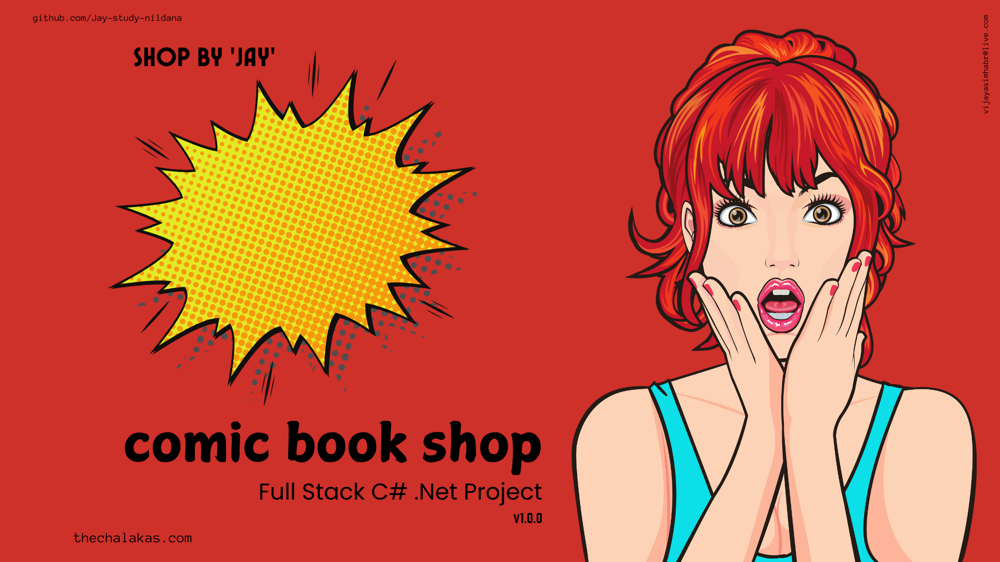
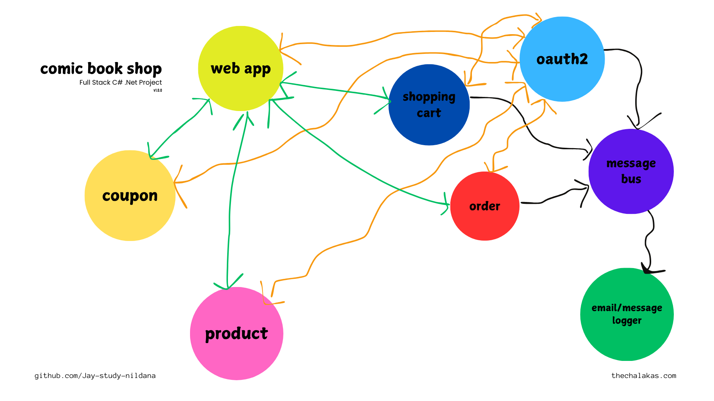

# Comic Book Shop - Documentation - Version 1.0.3

welcome to the comic book shop. A full stack .net project.

want to contribute or report issues, repo is [available here](https://github.com/Jay-study-nildana/comicbookshop).

GitHub Project Board is [available here](https://github.com/users/Jay-study-nildana/projects/8)

# Project Architecture

read more about the project architecture [here](projectarc.md)

# More Explanations

1. [how to run](howtorun.md)
   1. [notes about sql server](sqllocal.md)
   1. [notes about azure service bus](azureservicebus.md)
   1. [notes about auth](auth.md)
   1. [notes about stripe](stripe.md)
   1. [notes about dummy data](dummydata.md)
1. [issues and known problems](issues.md)
1. [video tutorials](video.md)

# book a session with me

1. [calendly](https://calendly.com/jaycodingtutor/30min)

# hire and get to know me

find ways to hire me, follow me and stay in touch with me.

1. [github](https://github.com/Jay-study-nildana)
1. [personal site](https://thechalakas.com)
1. [upwork](https://www.upwork.com/fl/vijayasimhabr)
1. [fiverr](https://www.fiverr.com/jay_codeguy)
1. [codementor](https://www.codementor.io/@vijayasimhabr)
1. [stackoverflow](https://stackoverflow.com/users/5338888/jay)
1. [Jay's Coding Channel](https://www.youtube.com/channel/UCJJVulg4J7POMdX0veuacXw/)
1. [medium blog](https://medium.com/@vijayasimhabr)
